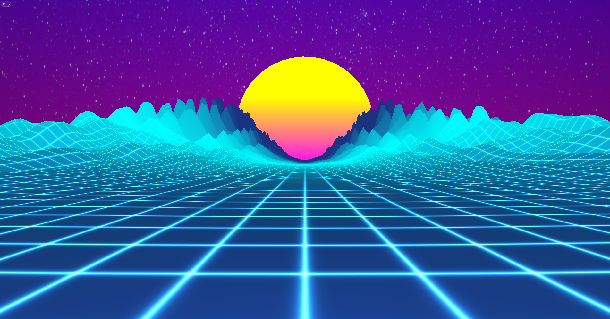

Synthwave
=========
An OpenGL animation in retro synthwave style.

```sh
./synthwave
```

[![cpp version][shield-cpp]](#)
[![OpenGL version][shield-opengl]](#)
[![Build status][shield-build]](#)
[![Code coverage][shield-coverage]](#)
[![MIT licensed][shield-license]](#)



Dependencies
------------

CGP requires
* A C++14 (or greater) compatible compiler (GCC/CLang, or a recent Visual Studio).
* An OpenGL 3.3 (or greater) compatible system.
* [libGLFW](https://www.glfw.org/) and [pkgconfig](https://www.freedesktop.org/wiki/Software/pkg-config/) installed for Linux/MacOS system.

Build & Run
-----------

### Linux/MacOS

Go into the scene folder
```sh
cd .\scenes_epita_ani3d\synthwave\
```

* _Method 1._ Using the provided Makefile:
```sh
make -j$(nproc)
./synthwave
```

* _Method 2._ Using the provided CMakeLists.txt:
```sh
mkdir build & cd build
cmake ..
make
cd .. & ./build/synthwave
```

### Windows

* _Method 1._ Create a Visual Studio project using CMake
* _Method 2._ Open the CMakeLists.txt using the internal CMake tool from Visual.

_Once opened by Visual Studio, the project should be configured to compile and be executed directly without further setup. Make sure your Windows version is updated for Visual Studio to be able to compile correctly C++14._

License
-------

Synthwave is licensed under the [MIT](#) license.

Copyright &copy; 2022, Heloïse Fabre, Temano Frogier, Alexandre James

[shield-cpp]: https://img.shields.io/badge/C%2B%2B-14-blue
[shield-opengl]: https://img.shields.io/badge/opengl-3.3-blue
[shield-build]: https://img.shields.io/badge/build-passing-brightgreen
[shield-coverage]: https://img.shields.io/badge/coverage-100%25-brightgreen.svg
[shield-license]: https://img.shields.io/badge/license-MIT-blue.svg